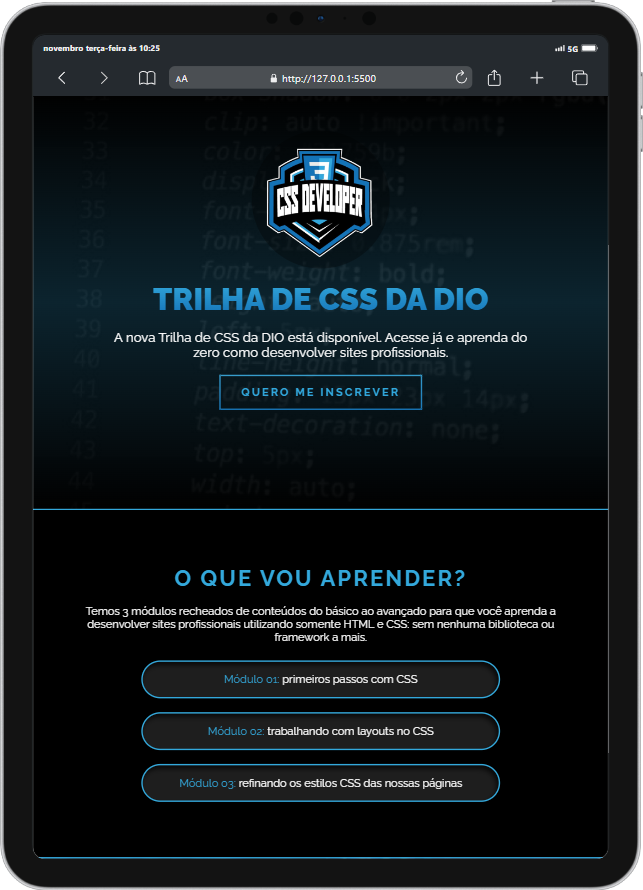
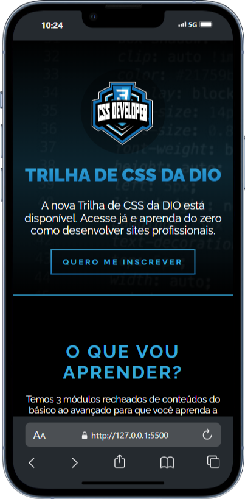

# Trilha CSS Challenge

Este é um projeto de recriação de uma landing page desafiada. A página foi recriada do zero e, para garantir uma experiência de usuário fluida e adaptável, foi utilizada apenas **HTML** e **CSS** para tornar a página totalmente **responsiva**.

## Descrição do Projeto

A landing page foi recriada com o objetivo de treinar as habilidades de **CSS** e criar um layout responsivo sem o uso de frameworks ou bibliotecas externas. O foco do projeto é na adaptação do layout para diferentes tamanhos de tela e no design visual da página.

### O que foi feito:
- Recriação do layout da página inicial com base no design fornecido.
- Aplicação de **CSS** para criar uma experiência responsiva e visualmente agradável em diferentes dispositivos.
- Efeitos de transição e animações foram aplicados para melhorar a interatividade da página.

---

## Tecnologias Utilizadas
- **HTML5**
- **CSS3**
- **Responsividade (Media Queries)**

---

## Screenshots

Aqui estão algumas capturas de tela do projeto:

### 1. Tela Desktop


### 2. Tela Tablet


### 3. Tela Mobile


---

## Como Rodar o Projeto Localmente

Se você quiser rodar o projeto localmente, siga os seguintes passos:

1. Clone o repositório:

   ```bash
   git clone https://github.com/DavigfxSs/Trilha-Css-Challenge.git